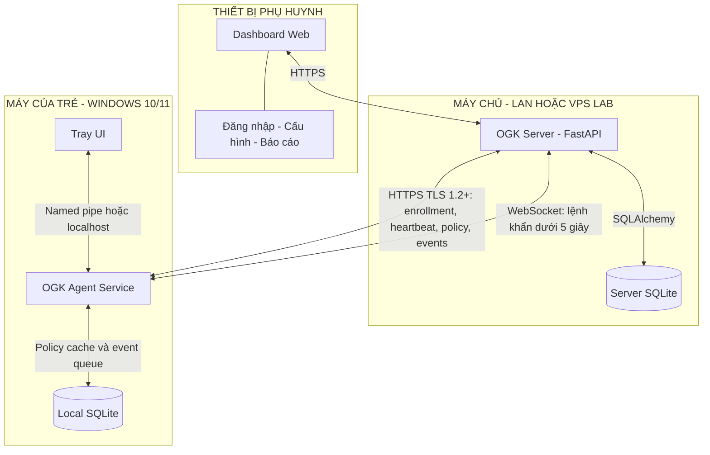
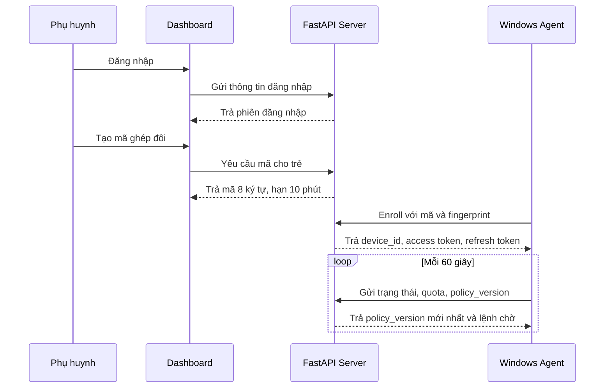

# Kiến trúc OpenGuard Kids

Tài liệu này chốt kiến trúc tổng thể của nhóm theo mục 4 trong đề bài. Phần
"Phạm vi chạy được cuối tuần 1" mô tả khung cần demo; các chức năng còn lại
được hoàn thiện trong tuần 2–4.

## Sơ đồ tổng thể

## Phạm vi chạy được cuối tuần 1

## Trách nhiệm các thành phần

| Thành phần | Trách nhiệm |
|---|---|
| Agent Service | Áp dụng policy, đếm thời gian, kiểm soát ứng dụng, lọc DNS và đệm sự kiện khi mất mạng |
| Tray UI | Minh bạch với trẻ, hiển thị thời gian/lý do chặn và gửi yêu cầu tới phụ huynh |
| Local SQLite | Lưu policy gần nhất và hàng đợi sự kiện ngoại tuyến |
| FastAPI Server | Xác thực, enrollment, quản lý trẻ/thiết bị, phát hành policy, nhận heartbeat/sự kiện và ghi audit |
| Server SQLite | Lưu policy, sự kiện, thiết bị, token, lệnh và audit log |
| Dashboard | Đăng nhập, tạo mã ghép đôi, cấu hình quota/lịch/danh sách chặn và xem báo cáo |

## Quyết định giao tiếp

- Dashboard và agent gọi server qua HTTPS; bản triển khai chính thức yêu cầu TLS 1.2+.
- Agent gửi heartbeat mỗi 60 giây.
- Lệnh khẩn sử dụng WebSocket và phải đến agent trong vòng 5 giây.
- Tray UI giao tiếp với Agent Service bằng named pipe hoặc HTTP localhost có token.
- Khi ngoại tuyến, agent tiếp tục dùng policy cache, đếm giờ và đệm sự kiện để đồng bộ lại theo lô.
- Policy có phiên bản và chữ ký toàn vẹn; agent từ chối policy bị sửa đổi.

## Quyết định còn phải chốt

Nhóm phải quyết định số ngày `N` và lựa chọn fail-open hay fail-closed khi policy
hết hạn do máy trẻ mất kết nối dài ngày. Quyết định này cần được giải thích trong
báo cáo và khi vấn đáp.
