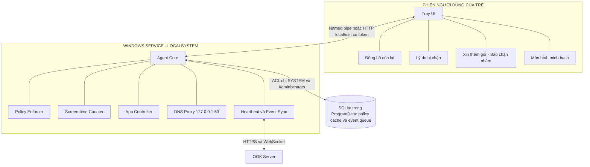
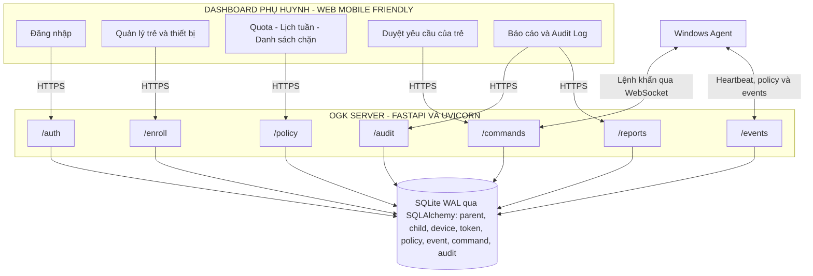

# Kiến trúc chi tiết OpenGuard Kids

Đây là kiến trúc mục tiêu theo mục 4 của đề bài. Một khối xuất hiện trong sơ đồ
không có nghĩa là khối đó đã được hiện thực ở tuần 1.

## Kiến trúc trên máy trẻ

## Kiến trúc Server và Dashboard

## Đối chiếu với đề bài

| Nội dung bắt buộc ở mục 4 | Vị trí trong sơ đồ |
|---|---|
| Windows Service chạy LocalSystem | Khối `WINDOWS SERVICE - LOCALSYSTEM` |
| Policy Enforcer | Khối `Policy Enforcer` |
| Screen-time Counter | Khối `Screen-time Counter` |
| App Controller | Khối `App Controller` |
| DNS Proxy tại 127.0.0.1:53 | Khối `DNS Proxy 127.0.0.1:53` |
| Tray UI chạy trong phiên người dùng | Khối `PHIÊN NGƯỜI DÙNG CỦA TRẺ` |
| Local SQLite và hàng đợi ngoại tuyến | Khối `SQLite trong ProgramData` |
| FastAPI, Uvicorn và các nhóm API | Khối `OGK SERVER` |
| SQLite WAL và SQLAlchemy | Kho dữ liệu Server |
| Dashboard dùng được trên điện thoại | Khối `DASHBOARD PHỤ HUYNH` |
| HTTPS, heartbeat và WebSocket | Các đường nối Agent–Server |
